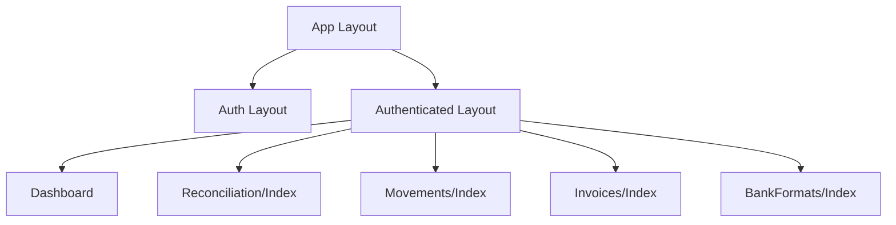
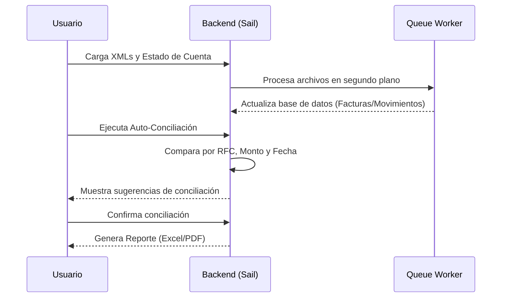

# Conciliación Bancaria

Aplicación para la conciliación de facturas XML (CFDI) con movimientos bancarios (estados de cuenta), con soporte multiempresa y automatización de procesos.

## Executive Summary

Conciliación Bancaria es una plataforma diseñada para automatizar el proceso de emparejamiento entre facturas electrónicas (XML) y movimientos bancarios. Facilita la gestión multiempresa a través de un sistema de "Teams" (Equipos), permitiendo a los usuarios cargar archivos masivos, configurar tolerancias de conciliación y generar reportes detallados en Excel y PDF.

## Domain Models

A continuación se detallan los modelos principales y sus relaciones:

| Modelo            | Descripción                                                      | Relaciones Clave                                                                          |
| :---------------- | :--------------------------------------------------------------- | :---------------------------------------------------------------------------------------- |
| **User**          | Usuario del sistema.                                             | `belongsToMany(Team)`, `belongsTo(Team, 'current_team_id')`                               |
| **Team**          | Representa una empresa o entidad legal.                          | `hasMany(Factura)`, `hasMany(Movimiento)`, `hasMany(Conciliacion)`, `hasMany(BankFormat)` |
| **Factura**       | Registro de un XML (CFDI).                                       | `belongsTo(Team)`, `hasMany(Conciliacion)`                                                |
| **Movimiento**    | Registro de un estado de cuenta bancario.                        | `belongsTo(Team)`, `hasMany(Conciliacion)`, `belongsTo(BankFormat)`                       |
| **Conciliacion**  | El vínculo entre una Factura y un Movimiento.                    | `belongsTo(Factura)`, `belongsTo(Movimiento)`, `belongsTo(User)`                          |
| **BankFormat**    | Plantilla de mapeo para diferentes layouts bancarios.            | `belongsTo(Team)`, `hasMany(Movimiento)`                                                  |
| **Archivo**       | Registro de carga de un archivo (XML o CSV).                     | `belongsTo(Team)`, `belongsTo(User)`                                                      |
| **Tolerancia**    | Configuración de rangos permitidos para conciliación automática. | `belongsTo(Team)`                                                                         |
| **ExportRequest** | Registro de peticiones de reportes en segundo plano.             | `belongsTo(User)`, `belongsTo(Team)`                                                      |

## API & Endpoint Map

### Auth & Profile

| Method | Route       | Action           |
| :----- | :---------- | :--------------- |
| GET    | `/login`    | Mostrar login    |
| GET    | `/register` | Mostrar registro |
| GET    | `/profile`  | Editar perfil    |

### Team Management

| Method | Route                          | Action           |
| :----- | :----------------------------- | :--------------- |
| POST   | `/teams`                       | Crear equipo     |
| GET    | `/teams/members`               | Listar miembros  |
| POST   | `/teams/members`               | Invitar miembro  |
| DELETE | `/teams/{team}/members/{user}` | Eliminar miembro |

### Mesa de Trabajo (Reconciliation)

| Method | Route                    | Action                        |
| :----- | :----------------------- | :---------------------------- |
| GET    | `/reconciliation`        | Dashboard de conciliación     |
| POST   | `/reconciliation`        | Crear conciliación manual     |
| GET    | `/reconciliation/auto`   | Ejecutar auto-conciliación    |
| POST   | `/reconciliation/batch`  | Conciliación masiva           |
| GET    | `/reconciliation/export` | Solicitar exportación         |
| POST   | `/upload/files`          | Cargar XMLs/Estados de cuenta |

### Catalogs

| Method   | Route           | Action                     |
| :------- | :-------------- | :------------------------- |
| GET      | `/movements`    | Listado de movimientos     |
| GET      | `/invoices`     | Listado de facturas        |
| RESOURCE | `/bank-formats` | CRUD de formatos bancarios |

## Business Logic & Services

La lógica compleja se encuentra desacoplada en el directorio `app/Services`:

- **Parsers**: Clases encargadas de leer archivos CSV/Excel según el `BankFormat` seleccionado.
- **Xml**: Servicio para la extracción de datos de archivos XML (CFDI 4.0).
- **Reconciliation**: Motor de búsqueda de coincidencias basado en RFC, fecha y monto (considerando tolerancias).

## Frontend Component Tree

La interfaz utiliza **Inertia.js** con **Vue 3**:

## Business Workflow

